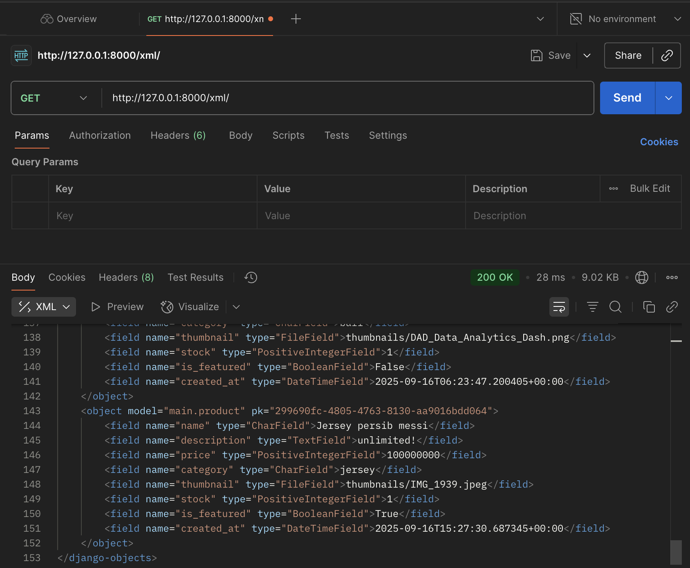

1. Data delivery dibutuhkan karena berfungsi untuk menyampaikan data antar komponen dalam platform dengan format yang terstandar seperti JSON atau XML. Dengan adanya mekanisme ini, data bisa dipahami dengan konsisten, lebih efisien karena hanya mengirim informasi yang relevan, serta aman karena dapat dilengkapi enkripsi atau autentikasi. Selain itu, data delivery juga mempermudah integrasi dengan layanan eksternal seperti payment gateway atau API pihak ketiga sehingga platform dapat berjalan lancar dan saling terhubung.
2. Menurut saya, JSON lebih baik digunakan dibandingkan XML karena formatnya lebih sederhana, ringkas, dan mudah dibaca. JSON juga lebih efisien dalam proses penyimpanan serta pertukaran data, sekaligus lebih mudah diintegrasikan dengan berbagai bahasa pemrograman modern. Struktur JSON yang menyerupai objek di JavaScript maupun Python membuatnya lebih cepat diproses oleh mesin, sehingga sangat mendukung performa aplikasi yang membutuhkan respons cepat. Hal inilah yang menjadikan JSON jauh lebih populer dibandingkan XML, terutama dalam pengembangan aplikasi web maupun mobile yang menuntut kecepatan dan efisiensi tinggi.
3. Method is_valid() pada form Django berfungsi untuk memvalidasi data yang dikirimkan melalui form, seperti memastikan field wajib terisi, format data sesuai, dan aturan validasi lainnya terpenuhi. Method ini sangat penting karena data dari pengguna tidak bisa langsung disimpan ke database tanpa dicek terlebih dahulu, sehingga is_valid() menjamin integritas data sekaligus keamanan aplikasi.
4. csrf_token dibutuhkan pada form Django untuk mencegah serangan Cross-Site Request Forgery (CSRF), penyerang mencoba mengirim request palsu seolah-olah berasal dari pengguna. Token ini menjadi identitas unik yang diverifikasi server sehingga hanya request dari form resmi aplikasi yang diterima. Tanpa csrf_token, server tidak dapat membedakan request asli dan palsu, sehingga penyerang dapat memanfaatkan celah tersebut untuk melakukan aksi berbahaya seperti mengubah data, mengirim transaksi, atau mencuri informasi penting atas nama pengguna tanpa sepengetahuannya.
5. Dalam mengimplementasikan checklist tersebut, saya memulainya dengan memastikan model Product sudah tersedia di models.py, kemudian membuat berkas forms.py untuk mendefinisikan ModelForm agar proses validasi dan penyimpanan data lebih mudah. Setelah itu, saya menambahkan beberapa fungsi view di views.py, meliputi tampilan data dalam format XML, JSON, XML by ID, JSON by ID, serta view untuk menampilkan daftar produk, detail produk, dan form penambahan produk baru. Selanjutnya, saya membuat routing URL pada urls.py untuk setiap view yang sudah dibuat agar dapat diakses melalui browser. Setelah routing selesai, saya membuat tiga template utama, yaitu product_list.htmluntuk menampilkan daftar produk beserta tombol “Add” dan “Detail”, add_product.html untuk form penambahan produk baru, dan product_detail.html untuk menampilkan detail setiap produk. Semua langkah tersebut kemudian saya uji dengan menjalankan server Django, menambahkan data produk melalui form atau admin, dan memastikan data dapat ditampilkan baik dalam bentuk HTML maupun dalam format XML dan JSON.

